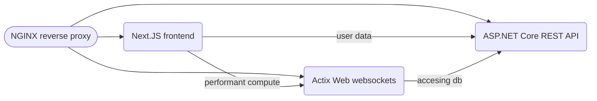

## Introduction
This folder should serve as a guide to the modules, goals and principles used in order to build the sigmyze website.

### Goals / Vision
The goal of this platform is to build a website that can help collect, analyze, and publish data to the wider internet. 

## Core Systems
The core of the website is distributed across these 4 different services:
1. **NGINX**: This is the reverse proxy that ties all of the distributed services together behind one single domain.
2. **Next.JS**: This is the frameowrk used to build the frontend for the website
3. **ASP.NET Core**: This is the framework used to build the REST service for most non performance server tasks
4. **Actix Web**: This is the framework used to provide high performance server computations to the client (such as data collection)

All of these systems are tied together using a database provided by MongoDB. The underlying services are all containerized using docker, in order to make deployment easier. The graph below should serve as a guide to how the core systems interact with each other:


## NGINX
NGINX was chosen over apache for being more performant and easy to setup. The core setps run in the docker container that is setup before execution are:
- install certbot
- create dir `/etc/letsencrypt`
- copy `conf.d` as well as `setup.sh`
- run `setup.sh`

THe functionality of `setup.sh` is simple. It exports AWS keys to the docker environment, creates the https cert using certbot, and then starts the nginx daemon for the server.

**Key NGINX Routes**

```
location /_next/static
```
This route serves all the built assets from next.js, such as JS bundles, css, index.html, and any other static artifacts that were requested.

```
location /static
```
This serves up images, and assets that are not cached by the browser.

```
location /api
```
This is the route that serves the REST API. It serves as a proxy pass, passing the request to `sigmyze-server:80`, with a *1GB* max body size for file uploads.

```
location /quanta-socket
```
This is the route that serves the websocket API to the browser. It upgrades the HTTP connection to a websocket one, and routes the traffic too `quanta-server:5025`.

```
location /
```
This is the default route that is served to all inbound requests that dont match any of the above patterns. It simply proxy passes to the next.js server running at `application:3000`.

## Next.JS
The core frontend is built using Next.JS along with typescript. Testing is provided through Jest. The pages constructed by Next.JS are:
- `index.tsx` (This is the landing page for the website, basically feature marketing)
- `about.tsx` (This is the about page for the website, helps for learning about the mission)
- `features.tsx` (This is a more detailed breakdown of the features that the platform offers)
- `drive.tsx` (When the user is logged in, this is their home screen. It is a drive of all their projects they have created on the platform)
- `auth` (this suroute contains all of the pages relating to authenticating onto the platform)
- `datasets` (This is the page that displays all of the publicly published datasets on the platform)
- `lunar` (This folder contains all of the pages relating to the lunar editor)
- `public` (This folder contains all the pages relating to public views, currently only datasets are supported)
- `quanta` (this folder contains all the pages relating to the quanta editor)

### Lunar
Lunar is the set of applications used within the platform to analyze data that has been collected. It has two core components:
- A document editor
- A chart editor

The goal is to be able to have these documents be shareable, as well as use them as the material to publish to the internet.

### Quanta
Quanta is the system used to collect and ingest data into the system. It uses a ndoe graph system in order to build the data pipeline into the system. Datasets created within the quanta editor can be used within documents and charts in the Lunar editor.

A more detailed document diving into the core systems behind the frontend can be found [here]()

## ASP.NET Core
Many of the core backend services for the website, such as authorization and user management are handled through the ASP.net core service, leveraging MongoDB as the database backend. The main API backends provided by this service are:
- `/api/v1/auth` This is the subdomain that handles all HTTP requests related to authentication within the platform
- `/api/v1/refresh/lunar` This is the subdomain that handles all HTTP requests related to editing a lunar project within the platform
- `/api/v2/dataset` This is the set of api endpoints that allow published datasets to be publicly accessible without an authorization token
- `/api/v2/quanta/public` This is the api endpoint used to access publicly published quanta datasets
- `/api/v2/organizations` This is the api endpoint to access organization info
- `/api/v2/drive` This is the api endpoint to execute operations on a users drive
- `/api/v2/quanta` This is the api leveraged by the quanta editor to update quanta projects

A more detailed breakdown into the ASP.net Core service can be found [here](./asp-rest-api/index.md)

## Actix Web Socket Service
In order to ensure timely computations, areas such as data collection needed to be written in a high performance environment. Thus Rust was chosen.
The application can communicate with the rust service through the WebSockets protocol. A more detailed breakdown of the web socket service can be found [here]()